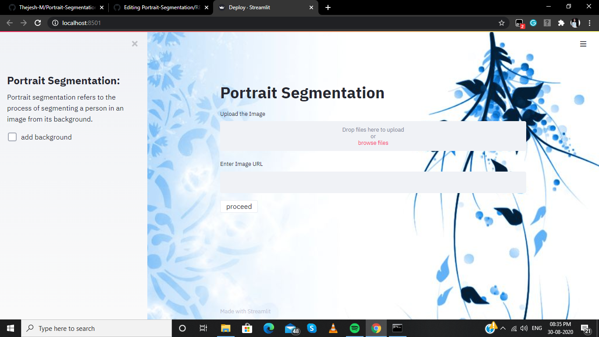
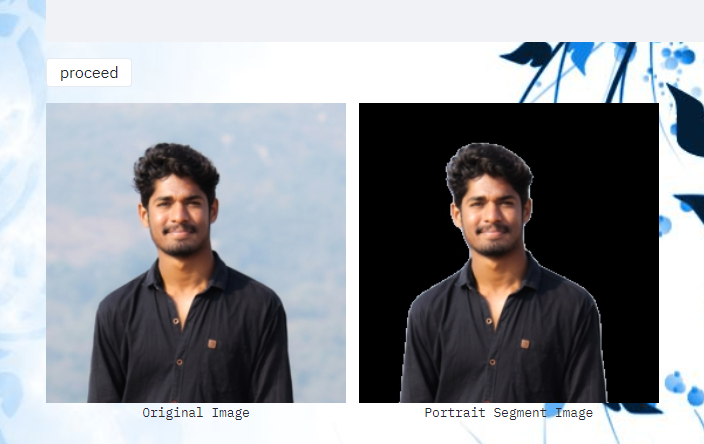
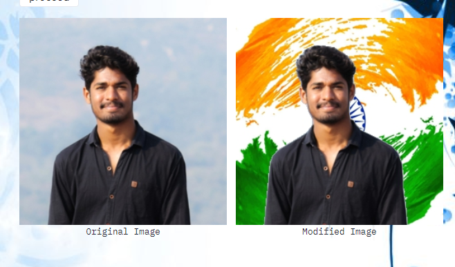

# Portrait-Segmentation
 Portrait Segmentation is to separate the portrait in a picture from the background to form different areas, which are distinguished using different tags. The model is trained with standard portrait datasets with around 35k images and developed based on the Segnet architecture with some modifications and deployed using Streamlit. It refers to the process of segmenting a person in an image from its background.Here we used the concept of semantic segmentation to predict the label of every pixel (dense prediction) in an image.
This technique is widely used in computer vision applications like background replacement and background blurring on mobile devices.
 
# Dataset 
https://www.kaggle.com/laurentmih/aisegmentcom-matting-human-datasets
**AISegment**: It is a human matting dataset for **binary segmentation** of humans and their background. This dataset is currently the largest portrait matting dataset, containing **34,427 images** and corresponding matting results. The data set was marked by the high quality of Beijing Play Star Convergence Technology Co., Ltd.,
Since we are using a **Segnet** as encoder for a head start, the training **quickly converges to 93% accuracy** within first couple of epochs. Also, here we use a flexible **learning rate schedule**  for training the model.

## Deployment Homepage

Deployment is done using **Streamlit** It is the fastest way to create data apps. Streamlit’s open-source app framework enables data scientists and machine learning engineers to create beautiful, performant apps in only a few hours!

### Trails:
##### With Segmented (empty background) :

#### Added a background image:

